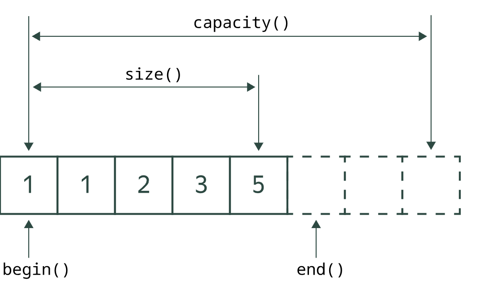

# Ссылки

1. [Описание стандартной библиотеки C++](https://en.cppreference.com/w/cpp/standard_library)

# Про фундаментальные типы

На [1] приводится таблица соответствия типов данных и размеров типов. Размер типа зависит от [2].

1. [Fundamental types](https://en.cppreference.com/w/cpp/language/types)
2. [Data models](https://en.cppreference.com/w/cpp/language/types#Data_models)

# Про резерв памяти в векторах

<figure style="text-align: center">
	
</figure>

# Про ссылки и указатели

**Ссылка** - объект, хранящий (сюрприз-сюрприз!) ссылку на какой-то другой объект. Ссылка не может
существовать сама по себе, она всегда должна указывать на объект, переназначать ссылки нельзя. Тип
ссылки такой же, что и у объекта.

```
int main() {
    std::string s1 = "Elementary, my dear Watson!";
    std::string& s2 = s1;  // тут ссылка!
}
```

# Про константы

Значение для константы фиксируется в момент присваивания. Значение не обязательно должно быть
известно в момент компиляции. Константность нельзя просто так отменить, её можно только добавить.

```cpp
    int x = 42;

    int& ref = x;  // обычная ссылка
    const int& cref = x;  // константная ссылка
    ++x;  // OK
    ++ref;  // OK
    ++cref;  // ошибка компиляции: псевдоним cref предназначен только для чтения

    int* ptr = &x;  // обычный указатель
    const int* cptr = &x;  // указатель на константу
    ++*ptr;  // OK
    ++*cptr;  // ошибка компиляции: разыменованный cptr — константа!
```

```
    const int x = 42;
    int* pX = &x;  // ошибка - cannot initialize a variable of type 'int *' with an rvalue of type 'const int *'

    const int x = 42;
    const int* pX = &x;
    x++;  // cannot assign to variable 'x' with const-qualified type 'const int'
    pX++;
    *pX = x + 1;  read-only variable is not assignable

    const int x = 42;
    const int* const pX = &x;
    pX++;  // cannot assign to variable 'pX' with const-qualified type 'const int *const'
```

# Про шаблоны

**Шаблоны** — это фрагменты обобщённого кода, в котором некоторые типы или константы вынесены в
параметры. Шаблонными могут быть функции, структуры (классы) и даже переменные. Компилятор
превращает использование шаблона в конкретный код, подставляя в него нужные параметры на этапе
*компиляции*. Шаблоны позволяют писать общий код, пригодный для использования с разными типами
данных.
